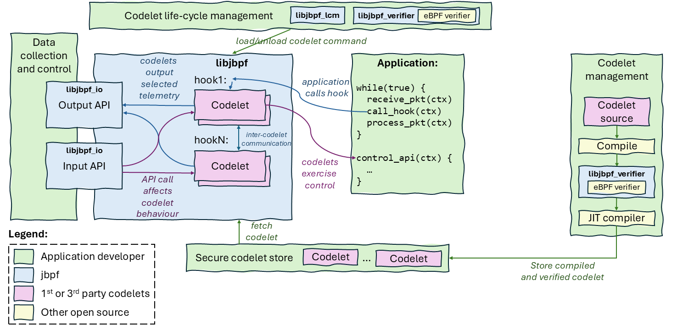

# Introduction
[](https://belgrade.visualstudio.com/janus/_build/latest?definitionId=143&repoName=microsoft%2Fjbpf&branchName=main)

Userspace eBPF instrumentation and control framework for deploying control and monitoring functions in a secure manner. It is part of [Project Janus](https://www.microsoft.com/en-us/research/project/programmable-ran-platform/) and provides probes for eBPF-like functionality outside of the Linux kernel.


# Architectural overview



The overall jbpf architecture is shown in the figure above. It consists of the following main components:
* **Application**: It is a user-provided executable that we want to instrument and control, built so that it is linked with the libjbpf library.
* **jbpf library**: The library that provides the functionality of deploying and executing codeletes, sending output data (output API) and receiving control data (input API).
* **Management framework**: This a framework to load/unload codelets (*codelet life-cycle management* and *secure codelet store*), collect telemetry and excert control (*data collection and control*) and build and deploy codelets (*codelet management*).

jbpf is not prescriptive in how the management framework should be built. It provides several APIs in the form of libraries: [`libjbpf_lcm`](docs/life_cycle_management.md) (life-cycle management), [`libjbpf_io`](docs/data_io.md) (input and output API) and [`libjbpf_verifier`](docs/verifier.md) (extended verifier), and a sample implementation of the management framework using the APIs. It expects that each user will use the APIs to integrate jbpf into their own prodution environment. 

For a high-level overview of the framework functionality, please read [this](./docs/overview.md). 


# Getting started

To build the library, [install the dependencies](./docs/dependencies.md), and run the following:
```
source ./setup_jbpf_env.sh
mkdir build
cd build
cmake ..
make -j
```
Check [here](./CMakeLists.txt) to see build options. 

Then follow [these](./examples/first_example_standalone/README.md) steps to run a simple example and read [here](./docs/understand_first_codelet.md) to understand the example better.
Other variants of this example can be found [here](./examples/first_example_ipc/) and [here](./examples/reverse_proxy/).

## Doxygen documentation
You can generate the documentation using Doxygen. To do so, run the following:
```
make doc
```

The documentation will be generated in the `$OUT_DIR/docs/html` directory.

# Further documentation

To learn further, explore our documentation:

* [High-level overview of *jbpf* instrumentation and control process](./docs/overview.md)
* Developing codelets:
  - [Writing your first codelet](./docs/understand_first_codelet.md)
* Integrating jbpf with your own project: 
  - [Install dependencies](./docs/dependencies.md)
  - [Integrate libjbpf](./docs/integrate_lib.md)
  - [Add new hook](./docs/add_new_hook.md)
  - [Add new helper function](./docs/add_helper_function.md)
  - [Add maps](./docs/maps.md)
  - [Verification](./docs/verifier.md)
  - [Data collection and control](./docs/data_io.md)
  - [Codelet life-cycle management](./docs/life_cycle_management.md)
  - [Best security principles](./docs/security.md)
* Experimental features:
  - [Serialization of IO messages](./docs/serde.md)
* Contributing to the framework:
  - [How to contribute?](./CONTRIBUTING.md)
  - [How to add a test?](./jbpf_tests/README.md)


For more information, also consider:
- [jbpf technical paper](https://www.microsoft.com/en-us/research/publication/taking-5g-ran-analytics-and-control-to-a-new-level/): A research paper that describe the motivation behind the framework. The paper is focused on 5G RAN instrumentation, but most concepts extend to arbitrary applications. 


# License

The jbpf framework is licensed under the [MIT license](LICENSE.md).
