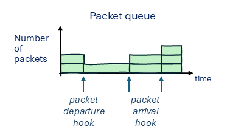

# High-level overview

The *jbpf* instrumentation and control library provides a flexible and safe user-mode instrumentation framework built on eBPF technology. 
It splits responsibilities between the core application developers and a potentially broader community of developers who want safe access to instrumentation and control, similar to eBPF in Linux kernel. 
However, *jbpf* operates entirely in user mode and makes no calls to Linux kernel.

The core application developers define common instrumentation points with access to important internal application structures and APIs, but without prescribing how these will be consumed. 
Other developers can deploy their own code, inlined, at the instrumentation points.
It allows them to efficiently process internal application data in an arbitrary way to extract particular information without needing to copy it elsewhere. 
The instrumentation code is statically verified before executed to enforce safety. 

## Simple conceptual example

Consider a network function that receives packets, processes and forwards them. 
A core developer decided to instrument the application with an instrumentation point whenever a packet is received or sent. 
They added two hook points in their code next to these two events, and pass the packet header to the hook (see [here](./understand_first_codelet.md) for an example of how to write a hook point).

An example of events in the system along with the hook calls is given in the figure above. 
We can see from the example that one can write codelets to generate several interesting insights into the system:
- Ingress and egress traffic statistics: 
  We can create various traffic statistics, including average throughput and inter-packet arrival times. 
  We can create these aggregates at various time scales, and for various flows or group of flows. 
- Queue size statistics:
  By correlating the input and output packet counts, we can calculate the queue size statistics. 
  For example, we can calculate the maximum queue size (in total or per flow), or how often the queue had more than X packets in it. 
- Per-packet delay:
  We can record a packet arrival and departure time for each packet, and calculate the time spent in the queue. 
  Again, we can create different aggregates, in general or per flow. 
- Modify forwarding behaviour:
  A developer may decide to expose control levers (which we call *helper functions*) that modify the way packets will be processed. 
  For example, we could allow a codelet to modify the egress IP address of a packet before it being sent. 
  So we could implement a functionality that forwards late packets to a particular IP address. 

Application developers can instrument the application for similar metrics even without *jbpf*. 
However, it is unwieldy to implement all of these different variants of metrics for each entity in the application (such as this queue).
The benefit of *jbpf* is that it decouples the core application functionality from the observability and control. 
The core app developers only need to provide the hooks at the right places. 
Different set of developers, at a later time, can add extra functionality without affecting the original application behaviour 
(or, in case when we decide to expose control, affecting it in a controlled manner). 

## Basic terminology

These are the basic terms used in the project:
* *Hook*: An instrumentation point at which we call user-provided code (see [here](./add_new_hook.md) for more on hooks). 
* *Codelet*: A piece of user-provided code that gets executed once a hook point is called in the application (see [here](./understand_first_codelet.md) for more on codelets). 
* *Codelet set*: A set of codelets that share maps or other things and have to be deployed together. 
* *Map*: A shared memory location that is accessible to one or more codelets, typically used to store data between invocations, share across codelets, or communicate with the rest of the system (see [here](./maps.md) for more on maps). 
* *Helper function*: A function implemented by the application and exposed to the codelet, typically used to affect the application behaviour or perform complex operations that are hard to verify (see [here](./add_helper_function.md) for more on helper functions). 

## Jbpf Emulator
The [jbpf emulator](./emulator.md) is a testing framework that allows to test *jbpf* codelets using Python.

## Relevant eBPF/uBPF tutorial

There are many similarities between eBPF/uBPF and *jbpf*. 
Here is a list of useful eBPF/uBPF tutorials that can help understand basic *jbpf* concepts. 
However, please keep in mind that, unlike eBPF, *jbpf* **doesn't use** kernel-level structures:
- [What is eBPF](https://ebpf.io/what-is-ebpf/)

